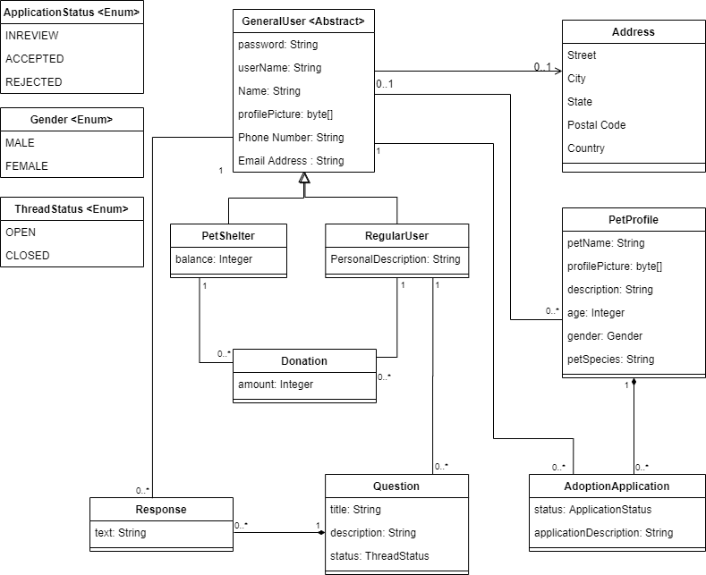

# Pet-Adoption-App

An application that allow users to create adoption posting and apply for adoption. The user type includes regular user and petshelter. The regular user have the ability to post pet profile, apply for adoption and ask questions in the forum. The shelter is able to make pet posting and accept donations from the regular user. Both user type can responds to question.

Sprint 1- Backend system and Persistent
We use object relational mapping to generate a database based on our domain model. The domain model is shown below.  

